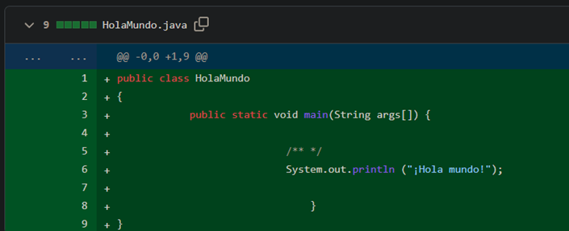
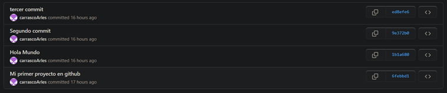

<table>
    <theader>
        <tr>
            <td></td>
            <th>
                UNIVERSIDAD NACIONAL DE SAN AGUSTIN 
                FACULTAD DE INGENIERÍA DE PRODUCCIÓN Y SERVICIOS 
                DEPARTAMENTO ACADÉMICO DE INGENIERÍA DE SISTEMAS E INFORMÁTICA 
                ESCUELA PROFESIONAL DE INGENIERÍA DE SISTEMAS
            </th>
            <td></td>
        </tr>
    </theader>
    <tbody>
        <tr><td colspan="3">Formato: Guía de Práctica de Laboratorio</td></tr>
        <tr><td>Aprobación:  2022/03/01</td><td>Código: GUIA-PRLD-001</td><td>Página: 1</td></tr>
    </tbody>
</table>

GUÍA DE LABORATORIO 

<table>
<theader>
<tr><th colspan="6">INFORMACIÓN BÁSICA</th></tr>
</theader>
<tbody>
<tr><td>ASIGNATURA:</td><td colspan="5">Programación Web 2</td></tr>
<tr><td>TÍTULO DE LA PRÁCTICA:</td><td colspan="5">Vim - Git - GitHub</td></tr>
<tr>
<td>NÚMERO DE PRÁCTICA:</td><td>01</td><td>AÑO LECTIVO:</td><td>2022 A</td><td>NRO. SEMESTRE:</td><td>III</td>
</tr>
<tr>
<td>FECHA INICIO::</td><td>25-Abr-2022</td><td>FECHA FIN:</td><td>29-Abr-2022</td><td>DURACIÓN:</td><td>04 horas</td>
</tr>
<tr><td colspan="6">INTEGRANTES:
    <ul>
        <li>Carrasco Choque Arles Melvin</li>
        <li>Chara Condori Jean Carlo</li>        
        <li>Choquecondo Aspilcueta Daniela Mabel</li>
        <li>Zapata Butron Reyser Julio</li>    
    </ul>
</td>
</<tr>
<tr><td colspan="6">DOCENTES:
<ul>
<li>Anibal Sardon</li>
</ul>
</td>
</<tr>
</tdbody>
</table>

# Vim - Git - GitHub

[![License][license]][license-file]
[![Downloads][downloads]][releases]
[![Last Commit][last-commit]][releases]

[![Debian][Debian]][debian-site]
[![Git][Git]][git-site]
[![GitHub][GitHub]][github-site]
[![Vim][Vim]][vim-site]
[![Java][Java]][java-site]

#

## OBJETIVOS TEMAS Y COMPETENCIAS

### OBJETIVOS

- Conocer el editor de texto Vim.
- Aprender a manejar el sistema de control de versiones Git y utilizar GitHub para trabajar de manera colaborativa.

### TEMAS
- Editor Vim
- Java
- Git
- GitHub

COMPETENCIAS

- C.c Diseña responsablemente sistemas, componentes o procesos para satisfacer necesidades dentro de restricciones realistas: económicas, medio ambientales, sociales, políticas, éticas, de salud, de seguridad, manufacturación y sostenibilidad.
- C.m Construye responsablemente soluciones siguiendo un proceso adecuado llevando a cabo las pruebas ajustada a los recursos disponibles del cliente.
- C.p Aplica de forma flexible técnicas, métodos, principios, normas, estándares y herramientas de ingeniería necesarias para la construcción de software e implementación de sistemas de información.

## EJERCICIOS PROPUESTOS
- Cree una cuenta de usuario en GitHub usando su correo institucional.
- [opcional por ahora] Configure su cuenta de estudiante (https://education.github.com/pack).

    **- Carrasco Choque Arles Melvin:**

    - 

    **- Chara Condori Jean Carlo:**

    - 
    
    **- Choquecondo Aspilcueta Daniela Mabel:**

    - 

    **- Zapata Butron Reyser Julio**

    - 

- Cree un nuevo proyecto personal y desarrolle el ejercicio resuelto en clase. Haga 3 commits como mínimo y muéstrelos. Commit para "¡Hola mundo!", otro para "Bienvenida al curso" y otro para imprimir su nombre.

    **- Carrasco Choque Arles Melvin:**

    URL del proyecto:<https://github.com/carrascoArles/proyectoPweb1>

    **1. Primer commit**
    - 

    **2. Segundo commit :**
    - 

    **3. Tercer commit :**
    - 
    - 

    **- Chara Condori Jean Carlo:**

    URL del proyecto: <https://github.com/JeanChara/holaMundo>

    **1. Primer commit**
    - 

    **2. Segundo commit :**
    - 

    **3. Tercer commit :**
    - 

    **4. Cuarto commit :**
    - 

    
    **- Choquecondo Aspilcueta Daniela Mabel:**

    URL del proyecto: <https://github.com/Dan-Ar5/Pweb2-lab1>

    **1. Primer commit**
    - 

    **2. Segundo commit :**
    - 

    **3. Tercer commit :**
    - 

    **4. Cuarto commit :**
    - 
    - 

    **- Zapata Butron Reyser Julio**

    URL del proyecto: <https://github.com/ReyserLyn/EjercicioResuelto-pweb2-lab01>

    **1. Primer commit**
    - 

    **2. Segundo commit :**
    - 

    **3. Tercer commit :**
    - 

    **4. Cuarto commit :**
    - 

- Cree un proyecto grupal para resolver el siguiente problema: Se desea crear una clase Calculator en Java, que tenga las siguientes operaciones: add, sub, mul, div, mod; estas operaciones recibirán dos enteros y devolverán un entero. (Forme grupos de 3 a 5 personas). Cree ramas para cada integrante y cada cierto tiempo una las ramas al main. No elimine nada para evidenciar ramas, main y commits.
- Debería haber minimo 7 commits:
    - 1er commit - Creación de la plantilla "Calculator.java"
    - 2do commit - Uniendo rama "ramma-add" al "main" para obtener metodo add().
    - 3er commit - Uniendo rama "ramma-sub" al "main" para obtener metodo sub().
    - 4to commit - Uniendo rama "ramma-mul" al "main" para obtener metodo mul().
    - 5to commit - Uniendo rama "ramma-div" al "main" para obtener metodo div().
    - 6to commit - Uniendo rama "ramma-mod" al "main" para obtener metodo mod().

 **URL: <https://github.com/ReyserLyn/pweb2-lab01-b>**

   - 
   - 
   - 
   
   **Ramas:**
   - 

   **Commits:**
   - 

#

## CUESTIONARIO
- ¿Por qué Git y GitHub son herramientas importantes para el curso?

Uno de los aspectos más importantes es el trabajo colaborativo ya que cada uno
puede agregar diferentes variaciones y aportar. Además de contar con un sistema
de versiones, lo que nos ayuda a ver qué es lo funcionaba antes de insertar una
nueva línea de código. También es un buen lugar social ya que se pueden compartir
proyectos y la comunidad te puede ayudar o resolver juntos un problema.

- ¿Qué conductas éticas deberían promocionarse cuando se usa un Sistema de Control de Versiones?

Se promociona que ya no haya plagio de código ya que se puede revisar el avance
que se hace mediante estas versiones, y poder verificar que el código es tuyo.
También el entorno colaborativo, mediante los commits hechos por cada
participante.
- ¿Qué son los entándares de codificación?

Son los acuerdos que llega y las pautas para que una codificación sea la mejor y se
pueda trabajar en ella con facilidad , como poner los comentarios en cada parte
explicando lo que se codifica, como también la estructura y los estilos

#

**III. CONCLUSIONES**

Las herramientas utilizadas nos fueron de mucha utilidad y se refieren a un mejor
uso colaborativo como también aumentar la productividad.

El vim que sirve para poder editar el texto y hacerlo en el mismo terminal para poder
pasarlo al git remoto, esté a su vez para poder ver los trabajos hechos y guardar las
versiones, para poder ver quien trabaja y quién no, y así poder llegar a un mejor
acuerdo.

**RETROALIMENTACIÓN GENERAL**

**REFERENCIAS Y BIBLIOGRAFÍA**

*● [https://www.w3schools.com/java/default.asp*](https://www.w3schools.com/java/default.asp)*
